# 映像配信サーバーの構築手順

## 忠告
この解説では、全ての操作をLinuxのCUI上で行います。
テキストファイルの編集や、プログラムのインストールなども全てCUI上で行います。
そのため、Linuxの基本的なコマンドをある程度把握していないと、作業が厳しくなります。
映像配信サーバーの構築を行う前に、Linux上でテキストファイルの編集ができる程度に勉強しておくと、作業がスムーズに進むと思います。

勉強方法ですが、Googleで「Linux とは」や「Linux 基本 コマンド」などと調べると、解説記事が大量に見つかります。
見つかったサイトであらかじめ予備知識を蓄えておくことをおすすめします。
テキスト編集を行うソフトは何でもよいですが、最初は`nano`がおすすめです。他には`vim`や`emacs`などがあります。
この解説では`vim`を用いてテキストを編集しますが、それぞれ好きなエディタに置き換えてテキストを編集してください。

## 概要
映像を配信するためのサーバーを構築する手順を解説します。
構築手順を説明する前に、使用するOSとプログラムを説明します。

### OS
サーバーのOSには`Ubuntu 18.04 (64bit)`を用います。
UbuntuはLinuxディストリビューションの1つです。
また、ここではOSを動かすためにConoha VPSでサーバーをレンタルしました。
VPSのプランは`CPU 1Core`　`SSD 30GB`を使用しました。

補足ですが、Conoha VPSはレンタル料金が1時間単位で計算されるので、ちょっとしたLinux環境の用意に適しています。
また、OSのインストールも1分ほどで終了するので、仮に実行環境を汚してしまっても、すぐにOSを再インストールし、気軽にやり直すことができます。

### 映像配信サーバー
映像配信サーバーを構築する方法はいくつかありますが、今回は`rtmp`形式の配信サーバーを構築します。
`rtmp`のURL("rtmp://example.com/"のようなアドレス)は`OpenCV`で直接再生することができるので、リアルタイムな画像処理を行いたい場合にも適しています。
映像配信サーバーには`nginx-rtmp-module`を用います。
これはrtmp形式の配信サーバーを`nginx`のプラグインという形で起動させることができるプログラムです。
`nginx`とは、webサーバーの1つです。

### 通信の暗号化及びVPN (Virtual Private Network)
今回の映像配信システムの使用するプロトコルであるrmtpは通信を暗号化しません。これではネットワークの通信経路に傍受者がいた場合に脆弱です。
具体的には映像の流出がおきます。これでは不味いので、暗号化する手段を考えます。

暗号化する仕組みにはいくつかの選択肢がありますが、今回はIP標準のネットワーク暗号化システムであるIPsecトンネルでVPNを構築します。
IPsecはレイヤー3で動作し (IPv4及びIPv6の) IPパケットをカプセル化して暗号化を行います。
これによりレイヤー4のTCP/UDP、及びそれ以上のレイヤー (http、https、そして今回使用するrmtp等) のプロトコルを透過的に暗号化します。
(透過的に暗号化: 上位プロトコルから見て暗号化機能が無いかのように振る舞い、上位プロトコルを一切を変更すること無く暗号化機能を提供することを言います)
また、メンテナンス用にsshログインを行うために IPsecトンネルを用意した方が良いと判断しました。

以下便宜的にIPsecトンネルを用いた暗号化系のことをVPNと呼びます。
(IPsecにはホスト間の通信をまとめて暗号化するトンネルモードと特定の通信を指定して暗号化するトランスポートモードの二種類がありますが、一般的にVPNと呼ばれるあるいはVPNと言われて想像するのはIPsecではトンネルモードの方です。)

今回のVPNの構築のために、`strongSwan`を使用します。

現代の多くのOSはカーネルにIPsecの機能を持ちますしLinuxもまたカーネルにIPsecの機能を持ちそれ自体が暗号化機能を提供していますが、
実際に暗号通信を行うためには、相互に認証し暗号化を行うための鍵を交換するための機能 (Ineternet Key Exchange IKEと呼ばれます) を別途用意する必要があります。
`strongSwan`には、`IKE daemon`である`charon`及びcharonの制御ツールである`swanctl`が含まれます。
Windowsの場合も同様にIKEを担当する`IKE and AuthIP IPsec Keying Modules`そしてそれのコントロール用である`リモートアクセス`に分かれています。

そしてこのVPN上にrtmpを流すことにより、セキュリティを担保します。

(なおIPsecには、サーバ・クライアントの概念はありませんが、以下便宜上strongSwanの事をVPNサーバーと呼ぶことにします。また、VPNサーバーに接続するコンピューターをVPNクライアントと呼ぶことにします。)

### Domain Name System (DNS) and Dyanmic update
DNSサーバーには`bind9`を用います。
このサーバーも無くても動作はしますが、作業効率を上げるために立てておきます。
VPNサーバーに接続したコンピューターにはそれぞれ、`10.0.0.103`のようなローカルIPアドレスが割り振られます。
しかし、そのIPアドレスは (多分) 接続するたびに変動します。
これは不便であるためコンピューターごとに固定のアドレスを指定したかったのですが、一部のOSではIPアドレスの固定ができないようです。
そこで、代替案としてDDNSサーバーを構築することにしました。
今回は、VPNに接続・切断がされるとDynamic Updateの仕組みを利用して、DNSにホスト名を登録・削除を行うスクリプトを作成しました。
この仕組みによって、VPNサーバーに接続するコンピュータごとに固定のドメイン名を割り振ることができます。
たとえば`10.0.0.103`のアドレスの代わりに、`computer001.example`といったドメイン名でアクセスできるようになります。

### WEBサーバー
WEBサーバーには`nginx`を用います。
`nginx`は映像配信サーバーである`nginx-rtmp-module`を動作させるために必要です。
また、ブラウザから配信の録画ファイルをダウンロードできるようにするためにも使用します。

## ステップ0 環境構築
まず、Conoha VPNにインストールしたUbuntuにsshでログインしてください。
デフォルトではrootユーザーでログインするようになっていますが、これは危険なので新規ユーザーを作成します。

```bash
adduser <任意のユーザー名>
```

`<任意のユーザー名>`の部分は適宜書き換えて実行してください。
最初にユーザー名のパスワードを聞かれます。
このパスワードはサーバーへのログインに使うので、できるだけ複雑で長いものが良いです。
忘れないようにメモをしてください。
次にパスワードの確認をされるので、再度パスワードを入力します。
続けて個人情報の入力を求められますが、全て空白で構いません。
ここで作成したユーザー名は今後「Ubuntuのユーザー名」と呼ぶことにします。

次に、追加したユーザーをsudoグループに追加します。

```bash
gpasswd -a <Ubuntuのユーザー名> sudo
```

追加したユーザーに切り替えます。

```bash
su <Ubuntuのユーザー名>
```

次に、sshでrootログインできないようにします。

```bash
sudo cp /etc/ssh/sshd_config /etc/ssh/sshd_config.backup
sudo vim /etc/ssh/sshd_config
```

`PermitRootLogin yes`となっている行を探し、`PermitRootLogin no`に変更して保存します。

最後に設定を再読み込みします。

```bash
sudo systemctl reload sshd.service
```

これにより、今後は今回作成したユーザーでsshログインするようにします。

また、sshの認証はパスワード認証の他に、公開鍵認証というものもあります。
一般的にはパスワード認証よりも公開鍵認証のほうが安全だと言われています。
ここでは解説しませんが、公開鍵認証の設定をすることをお勧めします。

## ステップ1 必要な情報の取得
ここでは、今後の作業で必要になる情報をあらかじめ整理しておきます。
取得した情報はどこかにメモしておくと良いと思います。
また、解説にはコマンドや設定ファイルのテキストなどが度々登場します。
それらの中には、自分で書き換えるべき箇所もありますので、コピーをした後に適宜書き換えてください。
書き換えるべき箇所は全て三角カッコ (`<`と`>`) で説明が書かれています。
例えば、`<サーバーのIPv4アドレス>`と書かれている場合は`123.45.67.89`のように変更してください。
`ABCD <サーバーのIPv4アドレス> EFGH`と書かれている場合は`ABCD 123.45.67.89 EFGH`のように変更してください。

### サーバーのドメイン名やIPアドレスなどの取得
ここでは次の4つの情報を取得します。

- サーバーのIPv4アドレス
- サーバーのIPv6アドレス
- サーバーのドメイン名
- IPv6のゲートウェイ

まずブラウザからConoha VPSの管理画面にログインします。
左側にある`サーバー`を開いて、サーバーリストから今回使用しているサーバーのネームタグをクリックします。

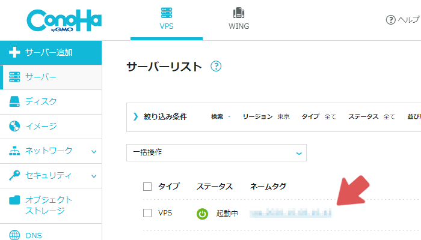

次に、`VPS設定`の項目内に`PTRレコード`の項目があるので、`IPv4`を選択します。
さらにその下に、`IPアドレス`と`逆引きホスト名`の項目があります。

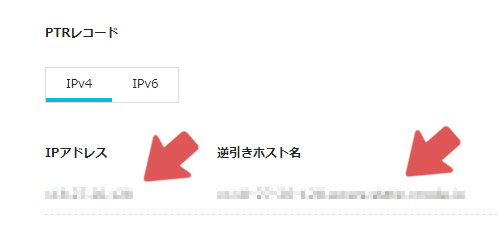

ここに記載されている文字列をそれぞれ`サーバーのIPv4アドレス`と`サーバーのドメイン名`としてメモしておきます。
次に、`PTRレコード`を`IPv6`に切り替え、もう一度`逆引きホスト名`の項目を見ます。

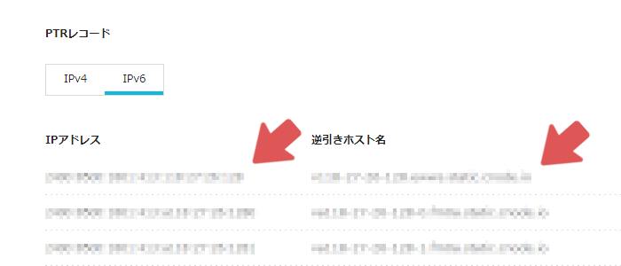

この中に、先ほど取得した`サーバーのドメイン名`と同一のホスト名があります (恐らく1番上にあります) 。
そのホスト名に対応しているIPアドレスを`サーバーのIPv6アドレス`としてメモしておきます。
次に、`ネットワーク情報`の項目内にある`タイプ`を`IPv6`に変更します。
さらに下のほうに`ゲートウェイ`という項目があります。

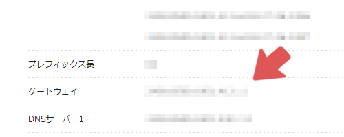

このアドレスを`IPv6のゲートウェイ`としてメモしておきます。

## ステップ2 証明書の発行
証明書とは、自分が偽物ではないことを証明するためのデータで、相手側に送信し相手側がその証明書の正当性を検証することにより正当性が保障されます。
この証明書は認証局から発行されます。有名な認証局には、政府認証基盤のブリッジ認証局やマイナンバーカードの署名を取り扱う署名用認証局、民間のVerisign, Inc (ベリサイン) そして、証明書の普及を目的として無料で発行を行う`Let's Encrypt`等があります。
詳しい仕組みについては、IPAの[「デジタル署名」](https://www.ipa.go.jp/security/pki/024.html)や[「認証局および周辺要素」](https://www.ipa.go.jp/security/pki/032.html)の解説が参考になります。
この証明書はIKEの鍵交換の際に自己の証明のために使われます。他の方法としてはパスワードによる認証等がありますが、いくつかのOSのVPNクライアントはVPNサーバ側の認証に証明書が必須になっているために今回は証明書を使います。

また、認証局は自分で立てることも可能ですが、その場合は認証局自身を証明するファイル (ルート証明書) をVPNクライアント全てにダウンロードしてもらう必要があり、VPNを使う側にとっては面倒です。
そのため、今回は証明書を無料で発行してもらえる`Let's Encrypt`を使用します。
ただし、`Let's Encrypt`ではドメイン名が必要になります。
Conoha VPSではドメイン名がサーバーごとに付与されますが、それ以外の環境では別途ドメインを購入する必要があるかもしれません。

[Let's Encryptの公式サイト](https://letsencrypt.org/)

2020年時点では、`Let's Encrypt`から発行される証明書の有効期限は3ヶ月です。
証明書を手動で更新するのは面倒であるため、今回は`certbot`を使用して更新を自動化します。
まず、[certbotの公式サイト](https://certbot.eff.org/lets-encrypt/ubuntubionic-other)を参考に、必要なパッケージをインストールします。

```bash
sudo snap install core; sudo snap refresh core
sudo snap install --classic certbot
sudo ln -s /snap/bin/certbot /usr/bin/certbot
```

次に、証明書を発行します。

```bash
sudo certbot certonly --standalone
```

実行をすると`メールアドレス`と`同意するかどうか`と`サーバーのドメイン名`を聞かれるので、それぞれ入力していきます。
`メールアドレス`は適当に自分のメールアドレスを入力します。
`同意するかどうか`では`y`と入力します。
`サーバーのドメイン名`はステップ1で取得したものを使用します。
成功すると、`/etc/letsencrypt/live/<サーバーのドメイン名>/`に4つのpemファイルが生成されます。
`privkey.pem`は証明書の発行に使用された秘密鍵です。
`chain.pem`は認証局の証明書 (中間証明書) です。
`cert.pem`は自分のサーバーの証明書 (エンドエンティティ証明書) です。
`fullchain.pem`は`chain.pem`と`cert.pem`を1つにまとめたものです。

## ステップ3 VPNサーバーの構築
まず、必要なパッケージをインストールします。

```bash
sudo apt install -y charon-systemd libcharon-extra-plugins
```

次に、VPNに接続できるようにするために設定ファイルを編集します。

```bash
sudo vim /etc/swanctl/conf.d/responder.conf
```

設定ファイルは以下のようになります。

```/etc/swanctl/conf.d/responder.conf
authorities {
	lets-encrypt {
		# 中間証明書の絶対パス
		file = /etc/letsencrypt/live/<サーバーのドメイン名>/chain.pem
	}
}

connections {
	user {
		# IKEv2を使用
		version = 2

		# MOBile IKE と言って、携帯電話に代表されるIPアドレスが変更されるような環境で、IPアドレスが変更されてもIPsecの接続は継続されるようにされる機能です。
		mobike = yes

		# 通常IKEの認証ではまず、レスポンダに証明書の要求を送ってからレスポンダはそれに応答する形で証明書を送信してきます。
		# ただしmacOSでは、必ずレスポンダが証明書を送ってくるものとして待機します。
		# このために、macOSから接続を行うと、レスポンダが証明書を送ってこないので認証失敗する事になります。
		# この設定は、イニシエータからレスポンダに証明書が送られてこなくても、証明書を送信するという設定です。
		send_cert = always

		# IPsecで使用する暗号化方法を指定します。基本はdefaultで良いのですが、MS-Windowsはmodp1024以下しか受け取りません。
		# modp1024は2020年現在既に時代遅れでdefaultから外されていますが、Windowsからつながらないのは問題なので、追加してあります。
		proposals = aes256-sha384-ecp256-ecp521-modp1024,default

		rekey_time = 0s

		# VPNクライアントに割り振るプライベートIPの範囲の設定 (poolセクション内に記述した自分で決めたセクション名を書く)
		pools = user_ip

		fragmentation = yes

		dpd_delay = 30s

		# 自身のサーバーのIPv4アドレスとIPv6アドレス
		local_addrs = <サーバーのIPv4アドレス>,<サーバーのIPv6アドレス>

		local-1 {
			# 自身のサーバーの証明書の絶対パス (相対パスの場合は/etc/swanctl/x509/の内部が参照される)
			certs = /etc/letsencrypt/live/<サーバーのドメイン名>/fullchain.pem

			# 自身のサーバーのドメイン名
			id = <サーバーのドメイン名>

		}

		remote-1 {
			# VPNクライアントからVPNサーバーへアクセスするときの認証方式
			auth = eap-mschapv2

			# VPNクライアントのidはなんでも受け付ける (%anyは「なんでもOK」という特殊な値)
			eap_id = %any

		}

		children {
			user {
				# VPNクライアントは以下の範囲の通信のみをVPNを通して通信する
				local_ts = 10.0.0.0/24

				rekey_time = 0s

				dpd_action = clear

				# yamahaのルーターに対応するためらしい?
				esp_proposals = aes256-sha384,default

				# VPNクライアントの接続と切断時に、指定したスクリプトを実行するようにする
				updown = /etc/swanctl/script/updown.sh iptables

			}
		}
	}
}

pools {
	user_ip {
		# VPNクライアントに割り振るプライベートIPの範囲
		addrs = 10.0.0.100-10.0.0.200

		# DNSサーバーのIPアドレス
		dns = 10.0.0.1

	}
}

secrets {
	private-second {
		# 秘密鍵のファイル名 (秘密鍵は/etc/swanctl/private/の中に配置します)
		file = privkey.pem
	}

	# 以下はVPN接続の認証に用いるユーザー一覧です。
	# 必要に応じて増やしたり減らしたりしてください。

	# 1人目のユーザー
	eap-computer001 {
		# VPN接続の認証に用いるユーザー名
		id-computer001 = computer001

		# VPN接続の認証に用いるパスワード
		secret = <32文字ぐらいの長めのパスワード>
	}

	# 2人目のユーザー
	eap-computer002 {
		# VPN接続の認証に用いるユーザー名
		id-computer002 = computer002

		# VPN接続の認証に用いるパスワード
		secret = <32文字ぐらいの長めのパスワード>
	}

	# 3人目のユーザー
	eap-computer003 {
		# VPN接続の認証に用いるユーザー名
		id-computer003 = computer003

		# VPN接続の認証に用いるパスワード
		secret = <32文字ぐらいの長めのパスワード>
	}
}
```

なお、三角カッコ (`<`と`>`) で囲われている箇所は適宜書き換えてください。
書き換える内容はすべてステップ1で取得した情報を使用します。
設定ファイルの詳細な情報は[公式のページ](https://wiki.strongswan.org/projects/strongswan/wiki/Swanctlconf)から確認できます。

次に、秘密鍵のシンボリックリンクをswanctlのディレクトリ内に作成します。

```bash
sudo ln -s /etc/letsencrypt/live/<サーバーのドメイン名>/privkey.pem /etc/swanctl/private/privkey.pem
```

`<サーバーのドメイン名>`の箇所はステップ1で取得したサーバーのドメイン名に書き換えてください。
また、現在のドメイン名にはIPv4とIPv6の2つのアドレスがレコードに登録されていますがサーバーにはIPv4のアドレスのみが設定されています。
MacからVPN接続をする際、ドメインにIPv6が登録されている場合にはIPv6での接続を優先します。
しかし、サーバーはIPv4での通信しかできないため、この接続は失敗します。
接続が失敗するとMacは自動的にIPv4での接続に切り替えるのですが、失敗と判定されるまでに数十秒の時間を要します。
この問題を回避するため、サーバーがIPv6での通信も行えるように設定します。

念のため、設定のバックアップを作成してから編集を行います。

```bash
sudo cp /etc/netplan/10-gmovps.yaml /etc/netplan/10-gmovps.yaml.backup
sudo vim /etc/netplan/10-gmovps.yaml
```

内容は以下のようにします。
なお、yaml形式の設定ファイルはインデントも構文であるため、インデントを変更するとエラーが起こります。
vimでコピペをする際は自動的にインデント補正が行われ、正しく貼り付けられない場合があります。
このような場合にはノーマルモードで`:set paste`を実行してから入力モードで貼り付けを行うことでインデント補正などを無効化できます。

```/etc/netplan/10-gmovps.yaml
network:
  ethernets:
    eth0:
      addresses:
      - <サーバーのIPv6アドレス>/64
      dhcp4: true
      dhcp6: false
      accept-ra: false
      optional: true
      gateway6: <IPv6のゲートウェイ>
  version: 2
```

三角カッコ (`<`と`>`) で囲われている箇所は適宜書き換えてください。
書き換える内容はすべてステップ1で取得した情報を使用します。

また、デフォルトの設定では送られてきたパケットの宛先IPアドレスが自分宛てではない場合、パケットが破棄されます。
そのため、VPNクライアントから別のVPNクライアントへパケットを送る際にVPNサーバーを経由しますが、サーバーでパケットが破棄されるので通信ができなくなります。
この問題を回避するため、ipv4 forwardの有効化を行います。

```bash
sudo sh -c "echo 1 > /proc/sys/net/ipv4/ip_forward"
sudo sh -c "echo 'net.ipv4.ip_forward = 1' >> /etc/sysctl.conf"
```

次に、VPNクライアントの接続、切断時に実行されるスクリプトを作成します。

```bash
sudo mkdir /etc/swanctl/script
sudo touch /etc/swanctl/script/updown.sh
sudo chmod 0755 /etc/swanctl/script/updown.sh
```

これを編集することで、たとえばslackなどにVPNの接続通知を送ったりできるようになります。
今はとりあえずこのファイルには何も記述しません。
あとでまた編集します。

また、certbotが生成した秘密鍵や証明書はapparmorによりファイルシステムへのアクセスが制限されています。
しかし、swanctlはそれらのファイルを閲覧する権限がありません。
そのため、apparmorの設定をします。

```bash
sudo vim /etc/apparmor.d/local/usr.sbin.swanctl
```

内容は以下のようにします。

```/etc/apparmor.d/local/usr.sbin.swanctl
/etc/letsencrypt/archive/<サーバーのドメイン名>/*.pem r,
```

`<サーバーのドメイン名>`の箇所はステップ1で取得したサーバーのドメイン名に書き換えてください。
次に、apparmorを再起動し、設定を適応します。

```bash
sudo systemctl restart apparmor
```

これで、swanctlからLet's Encryptが生成した秘密鍵や証明書にアクセスできるようになります。

また、現在の設定では宛先が`10.0.0.0/24`の範囲のパケットのみがVPNを通して通信されるようになっています。
しかし、サーバー自身のIPアドレスはこの範囲には含まれていません。
そのため、VPNクライアントからVPNサーバーに対してVPN越しで通信することはできません。
これを修正するため、loインターフェースに10.0.0.1を追加します。

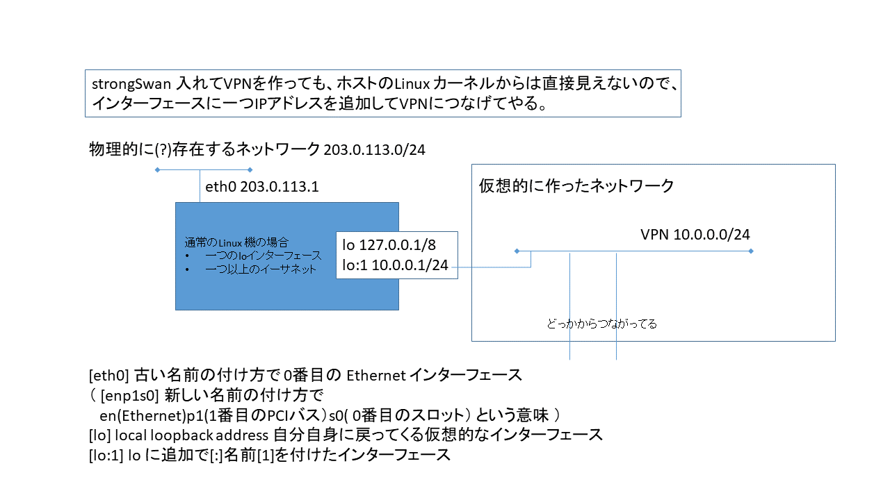

これにより、VPNクライアントからVPNサーバーへは10.0.0.1のアドレスでアクセスできるようになります。

```bash
sudo vim /etc/netplan/01-loopback.yaml
```

内容は以下のようにします。

```
network:
  version: 2
  renderer: networkd
  ethernets:
    lo: 
      match:
        name: lo
      addresses: [ 10.0.0.1/32 ]
```

変更した設定を次のコマンドで適応します。

```bash
sudo netplan --debug apply
```

次に、swanctlの設定を適応します。

```bash
sudo systemctl restart strongswan-swanctl
```

このコマンドの実行でコンソールに何も出力されなければ正しく設定されています。
もしもエラーが表示される場合は以下のように対処すると、原因がわかるかもしれません。

1. 新しくコンソールを開き、`sudo journalctl -f`を実行する  
2. 元のコンソールに戻って、再度`sudo systemctl restart strongswan-swanctl`を実行する  
3. 新しく開いたコンソールに詳細なエラー内容が出力されるので、適当なタイミングで`Ctrl+C`で出力を止める

## ステップ4 DNSサーバーの構築

まず、必要なパッケージをインストールします。

```bash
sudo apt install -y bind9 bind9utils
```

インストールするパッケージ名は本体の`bind9`と、そのユーティリティコマンドの`bind9utils`です。
設定中に動作しても問題なので、一時的にDNSサーバーを停止させます。

```bash
sudo systemctl stop bind9.service
```

次に、DNSサーバーにルートゾーン`example`を追加します。
これにより、`aaa.example`や`bbb.example`などのドメイン名を登録できるようになります。

```bash
sudo cp /etc/bind/named.conf.local /etc/bind/named.conf.local.backup
sudo vim /etc/bind/named.conf.local
```

設定ファイルは以下のようになります。

```/etc/bind/named.conf.local
//
// Do any local configuration here
//

// Consider adding the 1918 zones here, if they are not used in your
// organization
//include "/etc/bind/zones.rfc1918";

zone "example" {
        type master;

        // レコード情報を保存する場所の指定
        // 注意
        //   namedはapparmorによって制限されています。
        //   ディレクトリを変えようとは思わないでください。
        file "/var/cache/bind/db.example";

        // 動的にレコードを書き換えられるクライアントをlocalhostのみにする
        allow-update { localhost; };
};
```

次に、レコード情報を保存するための`db.example`を作成します。
はじめから作っても良いですが、今回は`/etc/bind/db.empty`をコピーして使います。

```bash
sudo cp /etc/bind/db.empty /var/cache/bind/db.example
sudo chown bind.bind /var/cache/bind/db.example
``` 

次に、VPNクライアント以外からDNSサーバーへアクセスされないようにするため、listenするIPを`10.0.0.1`に変更します。

```bash
sudo cp /etc/bind/named.conf.options /etc/bind/named.conf.options.backup
sudo vim /etc/bind/named.conf.options
```

設定ファイルは以下のようになります。

```/etc/bind/named.conf.options
acl "internalnet" {
        // VPNのアドレス範囲
        10.0.0.0/24;
};

options {
        directory "/var/cache/bind";

        // If there is a firewall between you and nameservers you want
        // to talk to, you may need to fix the firewall to allow multiple
        // ports to talk.  See http://www.kb.cert.org/vuls/id/800113

        // サーバーが他のネームサーバに問い合わせるときに使用するIPアドレスとポート番号
        query-source address * port *;

        // listenするIPアドレスとポート番号の指定
        listen-on port 53 {
                10.0.0.1;
                127.0.0.1;
        };
        listen-on-v6 { ::1; };

        // If your ISP provided one or more IP addresses for stable
        // nameservers, you probably want to use them as forwarders.
        // Uncomment the following block, and insert the addresses replacing
        // the all-0's placeholder.

        // forwarders {
        //      0.0.0.0;
        // };

        allow-transfer    { localhost; internalnet; };
        allow-query-cache { localhost; internalnet; };
        allow-query       { localhost; internalnet; };
        recursion yes;
        allow-recursion   { localhost; internalnet; };

        //========================================================================
        // If BIND logs error messages about the root key being expired,
        // you will need to update your keys.  See https://www.isc.org/bind-keys
        //========================================================================
        dnssec-validation auto;
};
```

また、MacOSやiOSのVPN接続時に`Split-horizon DNS`を動作させるには、`INTERNAL_DNS_DOMAIN`を送る必要があります。
これを行わない場合、MacやiPhoneからVPNに接続した際に`computer001.example`などのアドレスで他のVPNクライアントにアクセスできなくなります。
`charon-systemd`はデフォルトで`INTERNAL_DNS_DOMAIN`を送らない設定になっているので、これを変更します。

```bash
sudo cp /etc/strongswan.d/charon/attr.conf /etc/strongswan.d/charon/attr.conf.backup
sudo vim /etc/strongswan.d/charon/attr.conf
```

設定ファイルは以下のようになります。

```/etc/strongswan.d/charon/attr.conf
# Section to specify arbitrary attributes that are assigned to a peer via
# configuration payload (CP).
attr {

    # <attr> is an attribute name or an integer, values can be an IP address,
    # subnet or arbitrary value.
    # <attr> =

    # Whether to load the plugin. Can also be an integer to increase the
    # priority of this plugin.
    load = yes

    # DNSサーバーのIPアドレス
    dns = 10.0.0.1

    # ドメイン名の指定
    # 25はINTERNAL_DNS_DOMAINのマジックナンバー
    25 = example

}
```

次に、VPNクライアントが接続、切断したタイミングでDNSレコードを更新するスクリプトを書きます。
これにより、VPNクライアントから他のVPNクライアントへは`10.0.0.103`のようなIPアドレスのほかに、`computer001.example`のようなドメイン名でも接続できるようになります。なお、ここでの`computer001`はVPNクライアントのユーザー名になります。

```bash
sudo vim /etc/swanctl/script/updown.sh
```

スクリプトは以下のようになります。

```/etc/swanctl/script/updown.sh
#!/bin/sh
###############################################################
#
#
# @see FARP for IPv6 https://wiki.strongswan.org/issues/1008
#
###############################################################

# define a minimum PATH environment in case it is not set
PATH="/sbin:/bin:/usr/sbin:/usr/bin:/usr/sbin"
export PATH

DNSSERVER=127.0.0.1
DNSDOMAINNAME=example

# VPNへのアクセスや切断時にjournalctlへログを出力するようにする
if [ -n "$PLUTO_XAUTH_ID" ] ; then
        /usr/bin/logger "$PLUTO_VERB by $PLUTO_XAUTH_ID"
fi

NSUPDATE=/usr/bin/nsupdate
# nsupdateコマンドが実行可能で、かつ$PLUTO_XAUTH_IDが空文字でないとき
if [ -x "$NSUPDATE" -a -n "$PLUTO_XAUTH_ID" ] ; then
        # ${PLUTO_XAUTH_ID%%@*}は${PLUTO_XAUTH_ID}の文字列に@が含まれていた時、その文字以降の文字を全部消した文字列を返す
        # 例 : test@example.com => test
        DNSHOSTNAME=${PLUTO_XAUTH_ID%%@*}.$DNSDOMAINNAME
        logger $DNSHOSTNAME $PLUTO_VERB ${PLUTO_PEER_CLIENT%%/*}
        case $PLUTO_VERB in
                "up-client" )
                        $NSUPDATE <<EOF
server $DNSSERVER
update delete ${DNSHOSTNAME}. IN A
update add ${DNSHOSTNAME}. 3600 IN A ${PLUTO_PEER_CLIENT%%/*}
send
EOF
                        ;;
                "down-client" )
                        $NSUPDATE <<EOF
server $DNSSERVER
update delete ${DNSHOSTNAME}. IN A
send
EOF
                        ;;
                *)
                        logger "unknown PLUTO_VERB"
                        ;;
        esac
fi
```

次に、サーバー自身が今立てたDNSからドメインを検索できるようにする設定を変更します。

```bash
sudo vim /etc/netplan/10-gmovps.yaml
```

設定は以下のようになります。

```/etc/netplan/10-gmovps.yaml
network:
    ethernets:
        eth0:
            addresses:
            - <サーバーのIPv6アドレス>/64
            dhcp4: true
            dhcp6: false
            accept-ra: false
            optional: true
            gateway6: <IPv6のゲートウェイ>
            nameservers:
                addresses: [10.0.0.1]
                search: [example]
    version: 2
```

設定を適応します。

```bash
sudo netplan generate
sudo netplan apply
```

これでDNSサーバーの設定が完了しました。
DNSサーバーを起動する前にエラーが無いかを確認します。

```bash
sudo named-checkconf
```

何も出力されなければエラーが無いということになります。

最後にDNSサーバーを起動します。

```bash
sudo systemctl start bind9.service
```

また、DNSサーバーに登録された全てのドメイン名は以下のコマンドで取得することができます。

```bash
host -l example. 10.0.0.1
```

これは接続しているVPNクライアントの一覧としても利用できます。
そのため、このコマンドを応用することで以下のようなサイトを作成することもできます。

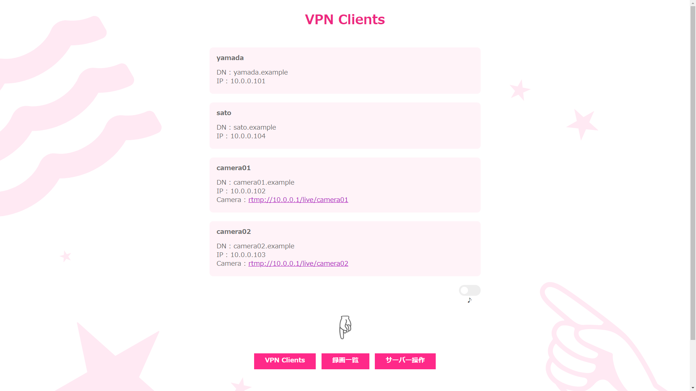

## 映像配信サーバーの構築

まず、必要なパッケージをインストールします。

```bash
sudo apt install -y nginx php-fpm libnginx-mod-rtmp apache2-utils ffmpeg
```

次に、nginxのデフォルトページをVPN内からのみ閲覧できるように設定します。

```bash
sudo touch /etc/nginx/conf.d/default
sudo rm /etc/nginx/sites-enabled/default
sudo ln -s /etc/nginx/conf.d/default /etc/nginx/sites-enabled/default
sudo vim /etc/nginx/conf.d/default
```

設定は以下のようになります。

```/etc/nginx/conf.d/default
server {
    # VPN内からのみアクセスできるように、10.0.0.1でlistenする
    listen 10.0.0.1:80;

    # indexファイルがなかった時にファイルツリーを表示する
    autoindex on;
    autoindex_exact_size off;
    autoindex_localtime on;

    # ドキュメントルートディレクトリの指定
    root /var/www/html;

    # 以下のファイルが存在する場合はそれをindexとして扱う
    index index.html index.htm index.nginx-debian.html;

    server_name _;

    location / {
        try_files $uri $uri/ =404;
    }
}
```

次に、録画ファイルを保存するためのディレクトリを作成します。
これにより、`http://10.0.0.1/archive/`から録画ファイルをダウンロードできるようになります。

```bash
sudo mkdir /var/www/html/archive
sudo chown www-data.www-data /var/www/html/archive
```

次に、rtmpサーバーの設定をします。

```bash
sudo cp /etc/nginx/nginx.conf /etc/nginx/nginx.conf.backup
sudo sh -c "echo 'include /etc/nginx/conf.d/rtmp;' >> /etc/nginx/nginx.conf"
sudo vim /etc/nginx/conf.d/rtmp
```

設定は以下のようになります。
もしも録画を行わない場合は設定ファイルの`record video;`の行を`record off;`に書き換えてください。

```/etc/nginx/conf.d/rtmp
rtmp {
    server {
        # VPN内からのみアクセスできるように、10.0.0.1でlistenする
        listen 10.0.0.1:1935;

        application live {
            # rtmpサーバーの有効化
            live on;

            # 録画を有効化するかどうか (video:有効 | off:無効)
            record video;

            # 録画ファイルの保存場所
            record_path /var/www/html/archive;

            # 録画ファイルの末尾に以下の形式で時刻を追記する
            record_suffix -%Y-%m-%d_%H-%M-%S.flv;

            # 録画終了時に任意のコマンドを実行する
            exec_record_done /etc/nginx/conf.d/record_done.sh $path $filename $basename $dirname;

            # サーバー側がクライアントの切断に気づかないことがあるため、180秒通信がなかった場合にはタイムアウトさせる
            drop_idle_publisher 180s;
        }
    }
}
```

次に、録画終了時に実行されるスクリプトを作成します。

```bash
sudo touch /etc/nginx/conf.d/record_done.sh
sudo chmod 0755 /etc/nginx/conf.d/record_done.sh
sudo vim /etc/nginx/conf.d/record_done.sh
```

スクリプトは以下のようになります。

```/etc/nginx/conf.d/record_done.sh
#!/bin/bash
# ${1} : 録画ファイルのフルパス (/var/www/html/archive/aaa.flv)
# ${2} : 録画ファイルのファイル名 (aaa.flv)
# ${3} : 録画ファイルのファイル名から拡張子をの除いた文字 (aaa)
# ${4} : 録画ファイルが保存されるディレクトリ (/var/www/html/archive)

# 配信の録画はflv形式であるため、mp4形式に変換する
ffmpeg -y -i ${1} -c copy ${4}/${3}.mp4 && rm ${1}
```

このスクリプトを編集することで、録画が停止したタイミングで任意のコマンドを実行することができます。
今回は録画のファイル形式をflvからmp4に変換するコマンドを実行するようにしました。

また、動画ファイルは比較的大きいのでサーバーのストレージを圧迫します。
そのため、今回は毎日06:00に2日以上前の録画を削除するコマンドを実行するようにします。
コマンドの定期実行にはcrontabを使用します。
crontabは初回実行時には編集するエディタを聞かれるので、好きなエディタを指定します。

```bash
sudo crontab -e -u www-data
```

一番下に以下の行をコピペして保存します。

```
0 6 * * * find /var/www/html/archive/ -type f -mtime +2 -delete
```

保存がうまくいったかどうかは次のコマンドで確認できます。

```bash
sudo crontab -l -u www-data
```

最後に設定を適応させます。

```bash
sudo systemctl restart nginx.service
```

これで、`rtmp://10.0.0.1/live/<任意の半角英数字>`で配信をすることができるようになります。

## 動作確認

### Windowsを使用する場合
まず、VPNの接続を行います。
タスクバーの`インターネットアクセス`から`ネットワークとインターネットの設定`を開きます。

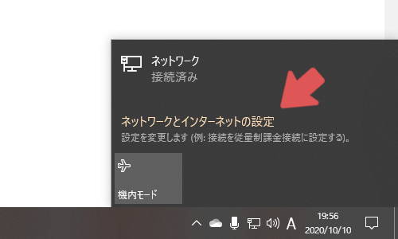

左の`VPN`を開き、`VPN 接続を追加する`をクリックします。

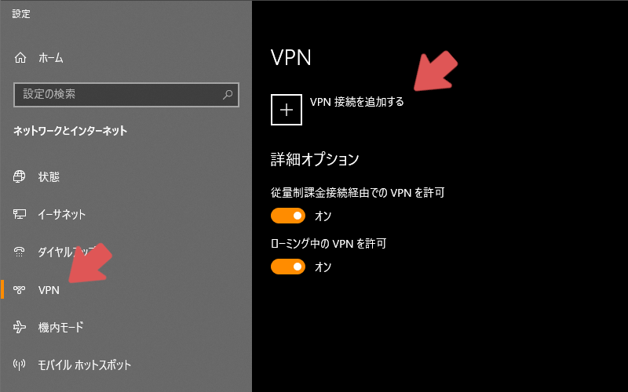

VPN接続を追加する設定画面が表示されるので、それぞれ入力します。
`VPN プロバイダー`は`Windows (ビルトイン)`を選択します。
`接続名`は何でも構いません。
`サーバー名またはアドレス`には、ステップ1で確認したサーバーのドメイン名を入力します。
`VPNの種類`は`IKEv2`を選択します。
`サインイン情報の種類`は`ユーザー名とパスワード`を選択します。
`ユーザー名`と`パスワード (オプション)`はステップ3の`/etc/swanctl/conf.d/responder.conf`の編集で記述したユーザー名とパスワードを入力します。
`サインイン情報を保存する`にチェックを入れると、VPN接続時にユーザー名とパスワードの入力を省略することができます。
全て入力し終えたら、最後に`保存`をクリックします。

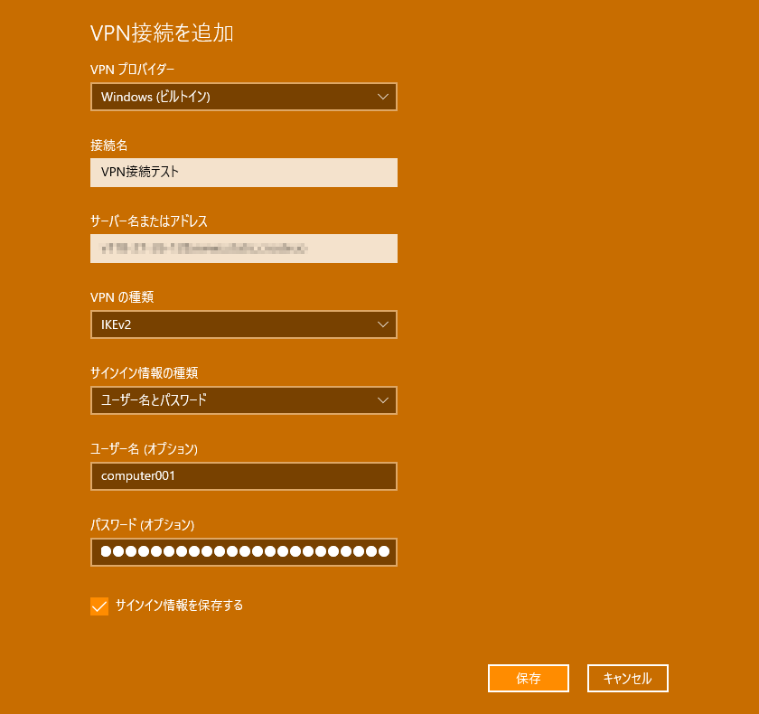

次に、`アダプターのオプションを変更する`を開きます。

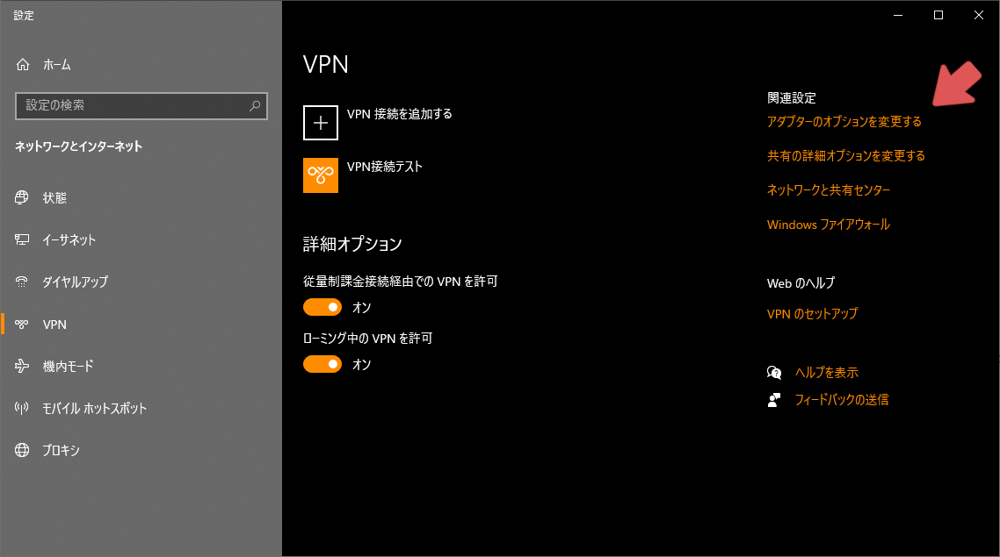

この中に先ほど追加したVPN接続があるので、これを右クリックして`プロパティ`を開きます。

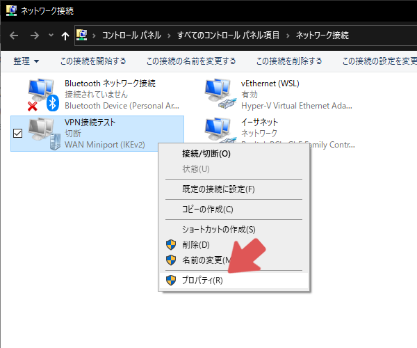

まず、`ネットワーク`タブの中の`インターネット プロトコル バージョン 6(TCP/IPv6)`を選択し、`プロパティ`を開きます。

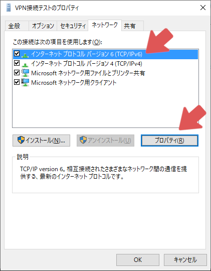

`詳細設定(V)...`を開きます。

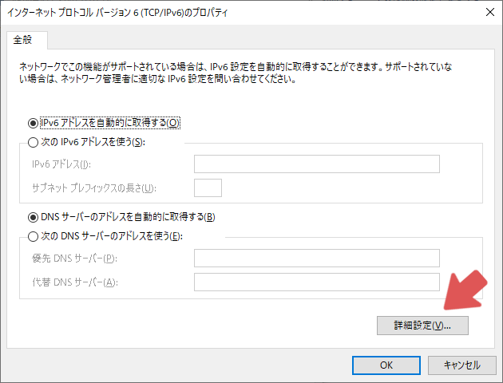

`リモート ネットワークでデフォルト ゲートウェイを使う(U)`のチェックを外し、`OK`をクリックします。

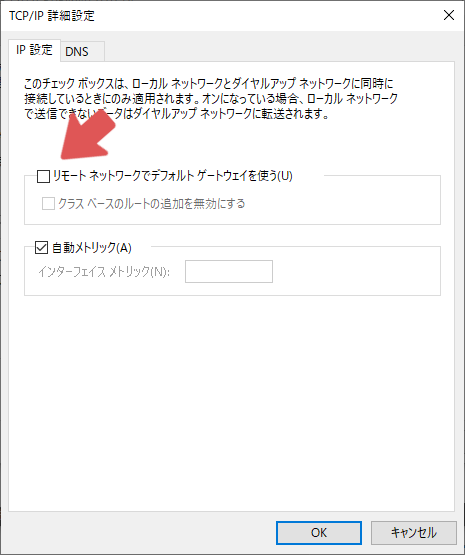

以下の画面に戻り、`インターネット プロトコル バージョン 4(TCP/IPv4)`を選択し、`プロパティ`を開きます。

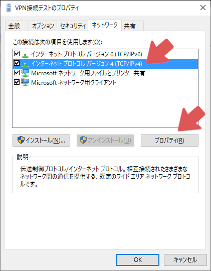

`詳細設定(V)...`を開きます。

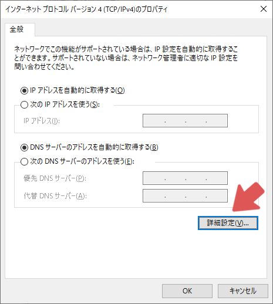

`リモート ネットワークでデフォルト ゲートウェイを使う(U)`のチェックを外し、`OK`をクリックします。

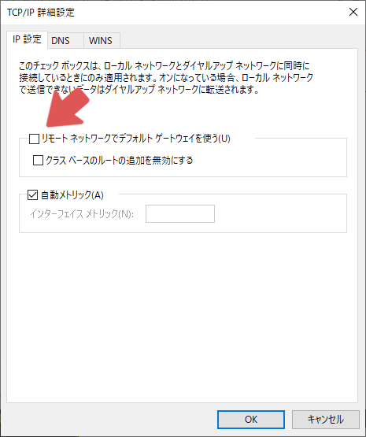

以上で接続の設定が完了しました。
最後に、VPNへ接続できるかを確認します。
タスクバーの`インターネットアクセス`を開くと、先ほど追加したVPN接続が表示されているので、クリックして`接続`をクリックします。

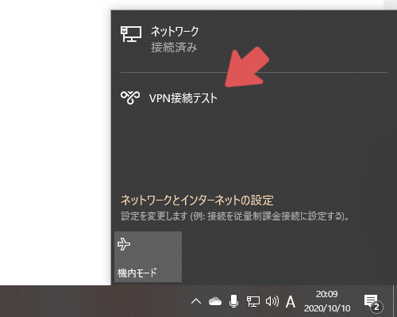

`接続済み`と表示されれば成功になります。

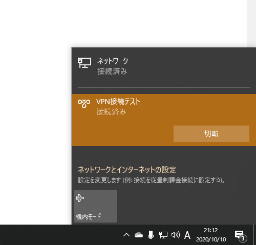

次に、サーバーとの接続が正常かを確認します。
コマンドプロンプトを起動してください。

まず、VPN越しでサーバーと疎通ができているかを確認するために`ping 10.0.0.1`を実行します。
正常であれば以下のようになります。

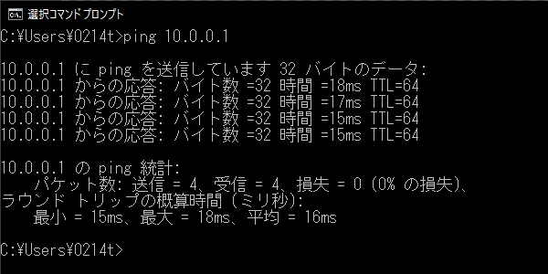

失敗すると以下のようになります。

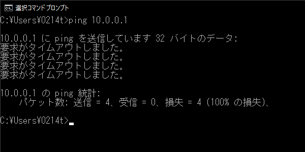

次に、VPNクライアントのルーティングが正しく設定されているかを確認するために`route print`を実行します。
正常であれば`IPv4 ルート テーブル`に以下の赤枠で囲った行が表示されます。

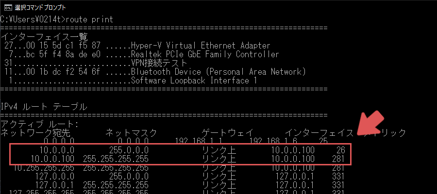

次に、DNSサーバーが正常かを確認するために、`ping <VPN認証に用いたユーザー名>.example`を実行します。
正常であれば以下のようになります。

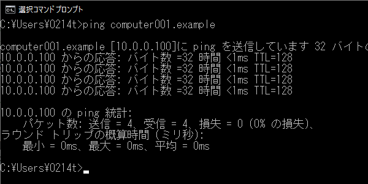

次に、映像配信サーバーが正常かを確認するために、Windowsで`ffmpeg`コマンドと`ffplay`コマンドが実行できるようにします。
やり方はネットで調べると出てくると思うので、ここでは省略します。

次に、`ffmpeg -re -f lavfi -i testsrc2=s=320x240 -t 600 -c:v libx264 -f flv rtmp://10.0.0.1/live/test`を実行します。
これは10分間テスト映像を配信するコマンドです。
この状態でコマンドプロンプトをもう1つ立ち上げて、`ffplay rtmp://10.0.0.1/live/test`を実行します。
正常であれば、以下のような映像が再生されます。


再生は`q`キーで終了できます。
配信は`Ctrl+C`で中断できます。
また、サーバーで録画を有効にしている場合には[http://10.0.0.1/archive/](http://10.0.0.1/archive/)にmp4の映像ファイルが追加されます。

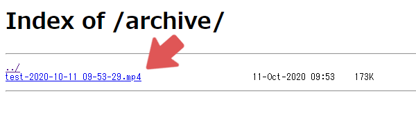

また、`rtmp://10.0.0.1/live/test`の`test`の部分は好きな文字列に変更することができます。
そのため、URLが重複しなければ同時に複数の配信を行うことができます。

補足ですが、ffmpegコマンドではカメラの映像や静止画、動画ファイルなどの様々な映像をrtmpで配信することができます。
配信の録画もできます。
ネットで調べると方法が記されていると思うので、ここでは解説は省略します。

### iPhoneを使用する場合

`設定`アプリを開き、`一般` > `VPN` > `VPN構成を追加...`を開きます。

`タイプ`には`IKEv2`を選択します。
`説明`は何でも構いません。
`サーバー`と`リモートID`にはステップ1で確認したサーバーのドメイン名を入力します。
`ローカルID`は空白のままで大丈夫です。
`ユーザ認証`にはユーザ名を選択します。
`ユーザ名`と`パスワード`はステップ3の`/etc/swanctl/conf.d/responder.conf`の編集で記述したユーザー名とパスワードを入力します。

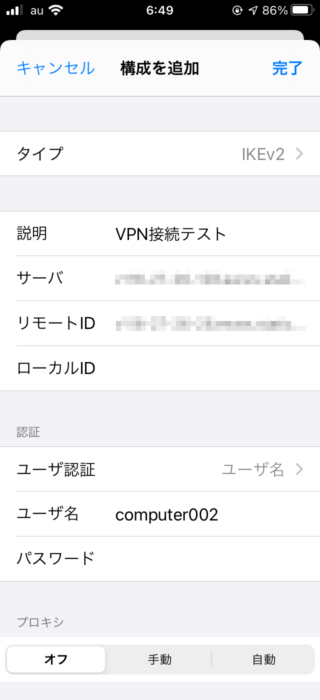

`完了`を押すとVPN構成が追加されるので、`状況`のスイッチをONにするとVPN接続が開始されます。

また、映像配信のテストはiPhoneだけでは行えないため、ここでは省略します。
配信の視聴は`VLC`というアプリをインストールすることで可能になります。

## 問題発生時の対処方法
実際に遭遇した問題と、その対処を載せておきます。

### VPN接続できない場合
エラーの詳細な内容を確認するために、サーバー側でエラーログの出力を行います。
`sudo journalctl -f`を実行した状態でVPNクライアントの接続を行ってください。
接続が失敗した直後に、サーバー側のログ出力を`Ctrl+C`で停止させます。
接続ができない場合はこのログを見ることで解決できることが多いです。
以下は私が遭遇したエラーログとその原因です。

#### no private key found for '<サーバーのドメイン名>'
`swanctl`から秘密鍵が見つからない場合に`journalctl`に出力されます。
`/etc/swanctl/conf.d/responder.conf`の設定ファイルで秘密鍵のファイル名を書き間違えている可能性があります。
もしくは、`/etc/swanctl/private/`内に秘密鍵が存在しない可能性があります。

### VPNクライアント同士での通信ができない場合
VPNサーバーとVPNクライアントとの通信はできるが、VPNクライアント同士での通信ができない場合は、サーバーの`forwarding`の設定が間違っている可能性があります。
ステップ3の`ipv4 forwardの有効化`をもう一度見直すことで解決できるかもしれません。

### DNSサーバーが正常でない場合
私が思いつく原因は以下の通りです。

- bind9が起動していない
- db.exampleが存在しない
- db.exampleへの読み書き権限がない

### 補足(VPNを経由してグローバルネットワークにアクセスする場合)
上記の設定では通常のVPNクライアントは`10.0.0.0`から`10.0.0.255`までの範囲のみをVPNを通して通信する。
これを`0.0.0.0`から`255.255.255.255`までの範囲に変更し、全ての通信をVPNを通して行うようにする。
まず、`/etc/swanctl/conf.d/responder.conf`の`local_ts`の右辺を`0.0.0.0/0`に変更する。

続けて、NATを立てるために次のコマンドを実行する。

```bash
modprobe iptable_nat
iptables -t nat -A POSTROUTING -s 10.0.0.0/24 -o eth0 -m policy --dir out --pol ipsec -j ACCEPT
iptables -t nat -A POSTROUTING -s 10.0.0.0/24 -o eth0 -j MASQUERADE
echo 1 > /proc/sys/net/ipv4/ip_forward
```

これですべての通信がVPN越しになる。
