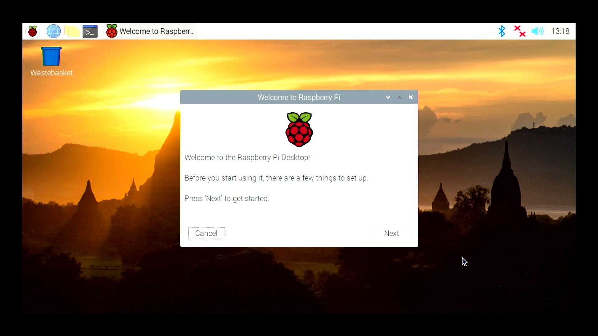
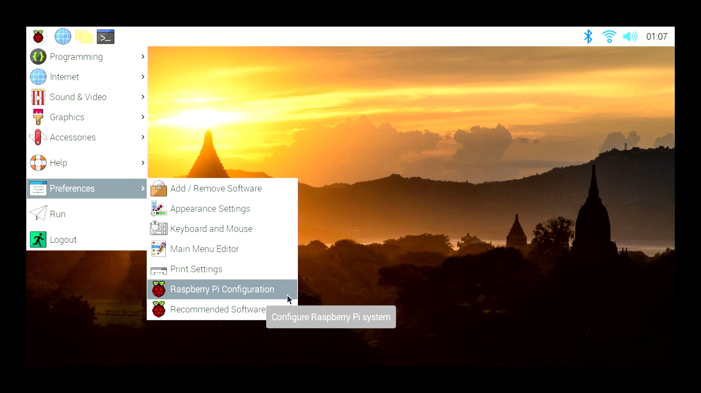
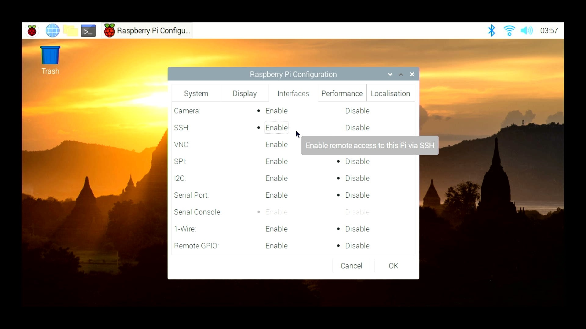
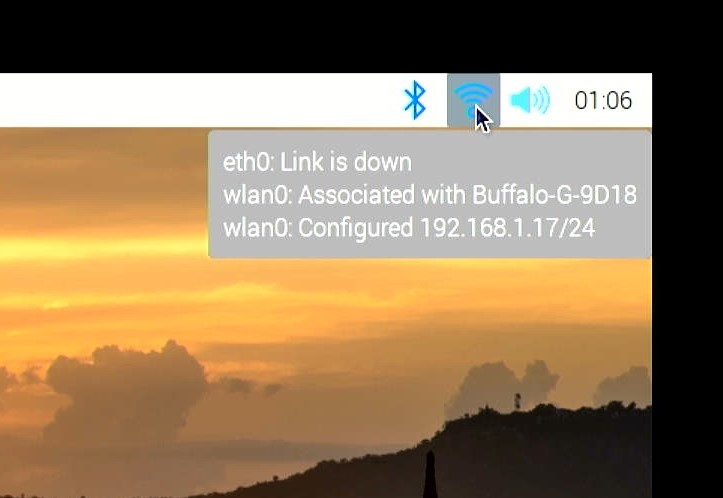

# raspberry piと映像配信サーバーを用いた監視カメラの制作

## 概要

`映像配信サーバーの構築手順`で構築した映像配信サーバーと`Raspberry Pi`を使って監視カメラを制作します。

## 必要なもの

### Raspberry Pi

今回は`Raspberry Pi 3 Model B+`を用いました。

### micro SD

今回はSandisk製の32GBのmicro SDを用いました。

### Webカメラ

今回は[ELP-USBFHD05MT-DL36](https://www.amazon.co.jp/dp/B017SWQBZU/ref=cm_sw_r_tw_dp_x_DyiHFbPJBWFZE)を用いました。

## ステップ0 環境構築
### OSの書き込み
まずはmicro SDにOSを書き込みます。
`Raspberry Pi`はOSを書き込むための専用ソフトを配布しているので、それを用いてOSを書き込みます。
ソフトは以下からダウンロードできます。

[https://www.raspberrypi.org/software/](https://www.raspberrypi.org/software/)

1. `Download for Windows`をクリック
2. ダウンロードしたプログラムをインストール
3. インストールした`Raspberry Pi Imager`を起動
4. `Operating System`に`Raspberry Pi OS (32-bit)`を選択
5. `SD Card`に書き込み先のSDカードを選択
6. `WRITE`をクリックして書き込み開始


### 起動する
1. OSを書き込んだmicro SDをRaspberry Piに差し込む
2. Raspberry PiとディスプレイをHDMIで接続する
3. Wi-Fiではなく有線LANを使用する場合は有線LANを接続する
4. マウスとキーボードを接続する
5. 電源を接続する

### 初期設定
初回起動時、以下のような画面が表示されるので、ここで初期設定を行います。



Raspberry Pi用のパスワードを求められるので、入力したパスワードをメモしておきます。
また、Wi-Fi接続をする場合はここで設定します。
最後にアップデートを行うか問われるので、アップデートしておきます。

### カメラとSSHの有効化
カメラにアクセスできるようにします。
また、WindowsからRaspberry Piにアクセス出来るようにSSH接続も有効化します。
以下の場所にRaspberry Piの設定画面があるので、それを開きます。



次に、Interfacesのタブ中にCameraとSSHの項目があるので、Enableに変更しOKを押します。



次に、Raspberry PiのIPアドレスを確認します。
右上にあるネットワークのアイコンからIPアドレスを確認できるので、その値をメモしておきます。



最後にWindowsのコマンドプロンプトからRaspberry Piに接続してみます。
`ssh pi@<Raspberry PiのIPアドレス>`を実行し、設定したパスワードを入力してログインします。


ここで念のために再起動しておきます。

### 公開鍵認証の設定
sshの認証はパスワード認証の他に、公開鍵認証というものもあります。
一般的にはパスワード認証よりも公開鍵認証のほうが安全だと言われています。
ここでは解説しませんが、公開鍵認証の設定をすることをお勧めします。

### 最低限のプログラムのインストール
次のコマンドをRaspberry Piにsshでログインして実行します。

```bash
sudo apt update -y
sudo apt upgrade -y
sudo apt install -y vim nano tmux wget ffmpeg
```

## ステップ1 VPNへの接続
まずRaspberry Piにsshでログインします。
`映像配信サーバーの構築手順`で構築したVPNサーバーへ接続できるようにします。

まずは必要なパッケージをインストールします。

```bash
sudo apt install -y charon-systemd libcharon-extra-plugins
```

次に設定の編集をします。

```bash
sudo vim /etc/swanctl/conf.d/initiator.conf
```

設定は以下のようにします。

```/etc/swanctl/conf.d/initiator.conf
connections {
	ikev2-eap-mschapv2 {
		# IKEv2を使用
		version = 2

		# 10秒おきに切断されていないかを確認する
		dpd_delay = 10s

		# VPNサーバーのアドレス
		remote_addrs = <サーバーのIPv4アドレス>

		# 仮想IPの指定(0.0.0.0は任意のアドレス)
		vips = 0.0.0.0

		# ESPパケットのUDPカプセル化を強制する
		encap = yes

		local-1 {
			# VPNクライアントからVPNサーバーへアクセスするときの認証方式
			auth = eap-mschapv2

			# VPN接続の認証に用いるユーザー名
			id = <VPN接続の認証に用いるユーザー名>
		}
		remote-1 {
			# サーバーのドメイン名
			id = <サーバーのドメイン名>

			# サーバーの証明書発行に使用したルート証明書のファイル名
			# (/etc/swanctl/x509ca/の中にあるファイル名を指定します)
			cacerts = root.pem
		}
		children {
			ikev2-eap-mschapv2 {
				# VPNを通して通信するIPの範囲
				remote_ts = 10.0.0.0/24

				# 起動時や切断時に自動的にVPNに接続するようにする
				start_action = start
				dpd_action = restart
				close_action = start
			}
		}
	}
}

secrets {
	eap-computer001 {
		id = <VPN接続の認証に用いるユーザー名>
		secret = <VPN接続の認証に用いるパスワード>
	}
}
```

なお、三角カッコ (`<`と`>`) で囲われている箇所は適宜書き換えてください。
書き換える内容はすべて`映像配信サーバー構築手順`で設定した情報を使用します。

次に、`Let's Encryptの`ルート証明書をダウンロードします。

```bash
sudo wget https://letsencrypt.org/certs/trustid-x3-root.pem.txt -O /etc/swanctl/x509ca/root.pem
```

次に、設定を適応します。

```bash
sudo systemctl restart strongswan-swanctl
```

次に、接続ができているかを確認します。

```bash
ping 10.0.0.1 -c 3
```

また、Raspberry Pi起動中にWi-Fiのアクセスポイントが消失すると、Wi-Fiは再接続を試みようとしますがVPNは自動的に再接続されません。
そのため、1分おきにVPNサーバーとの通信をpingで確認し、通信が失敗する場合はswanctlを再起動するように設定します。

```bash
sudo crontab -u root -e
```

設定の一番下に以下の行をコピーします。

```
* * * * * sh /home/pi/wifi.sh
```

これで1分おきに`/home/pi/wifi.sh`が実行されるようになります。
`/home/pi/wifi.sh`はまだ作成していないので、作成します。

```bash

touch /home/pi/wifi.sh
chmod 0755 /home/pi/wifi.sh
vim /home/pi/wifi.sh
```

スクリプトの内容は以下のようにします。

```/home/pi/wifi.sh
#!/bin/sh
ping -c 1 10.0.0.1
test $? -ne 0 && systemctl restart strongswan-swanctl.service
```

また、Raspberry PiがVPNに接続できていれば、Windowsから以下のコマンドでsshログインできるようになります。

```
ssh pi@<Raspberry PiがVPN接続の認証に用いたユーザー名>.example
```

これにより、Raspberry PiとWindowsが同じLANに接続に接続されていなくてもsshログインできるようになります。

## ステップ2 映像の配信
まずRaspberry Piにsshでログインします。
まずは映像の通信が行えるかを確認します。

```bash
ffmpeg -re -f lavfi -i testsrc2=s=320x240 -t 600 -c:v libx264 -f flv rtmp://10.0.0.1/live/test
```

次に、WindowsからVPNに接続し、VLCというソフトを用いて映像を視聴します。
VLCを開いて「ファイル」から「ネットワークストリームを開く」を開き、以下のアドレスを入力します。

`rtmp://10.0.0.1/live/test`

正常であれば、以下のような映像が再生されます。


次に、カメラの映像が配信できるかを確認します。

```bash
ffmpeg \
-f v4l2 -thread_queue_size 8192 -i /dev/video0 -c:v h264_omx \
-b:v 740k -bufsize 740k -vsync 1 -g 16 \
-f flv rtmp://10.0.0.1/live/test
```

先ほどと同様にWindowsから配信を確認します。
正常であれば、以下のような映像が再生されます。


私の環境では映像に5秒ほどラグがありました。

次に、Raspberry Pi起動時に自動的に配信されるようにします。

まずは起動時に実行されるスクリプトの作成をします。

```bash
touch /home/pi/startup.sh
chmod 0755 /home/pi/startup.sh
vim /home/pi/startup.sh
```

スクリプトの内容は以下のようにします。

```/home/pi/startup.sh
#!/bin/bash
# ここに記述されたコマンドはraspberry pi起動時に自動的に実行されます
# service : /etc/systemd/system/startup.service

ffmpeg \
-f v4l2 -thread_queue_size 8192 -i /dev/video0 -c:v h264_omx \
-b:v 740k -bufsize 740k -vsync 1 -g 16 \
-filter_complex " \
drawtext=fontfile=/usr/share/fonts/truetype/dejavu/DejaVuSansMono-Bold: \
x=12:y=12:fontsize=24:fontcolor=black@1:text='%{pts}', \
drawtext=fontfile=/usr/share/fonts/truetype/dejavu/DejaVuSansMono-Bold: \
x=10:y=10:fontsize=24:fontcolor=white@1:text='%{pts}' \
" \
-f flv rtmp://10.0.0.1/live/<VPN接続の認証に用いるユーザー名>
```

一番下の行の`<VPN接続の認証に用いるユーザー名>`は適宜書き換えて下さい。
次に、このスクリプトを起動時に実行されるようにサービスを作成します。

```bash
sudo vim /etc/systemd/system/startup.service
```

設定の内容は以下のようにします。

```/etc/systemd/system/startup.service
[Unit]
Description = custom startup daemon
[Service]
ExecStart = /home/pi/startup.sh
Restart = always
Type = simple
[Install]
WantedBy = multi-user.target
```

最後に設定を有効化します。

```bash
sudo systemctl enable startup.service
sudo systemctl start startup.service
```

次に、WindowsからVPNに接続し、VLCというソフトを用いて映像を視聴します。
VLCを開いて「ファイル」から「ネットワークストリームを開く」を開き、以下のアドレスを入力します。

`rtmp://10.0.0.1/live/<Raspberry PiがVPN接続の認証に用いたユーザー名>`

正常であれば、以下のような映像が再生されます。


これで、ラズパイを起動すると自動的にカメラの映像が配信されるようになります。

サーバーで録画を有効にしている場合は、[http://10.0.0.1/archive/](http://10.0.0.1/archive/)から録画データをダウンロードできます。